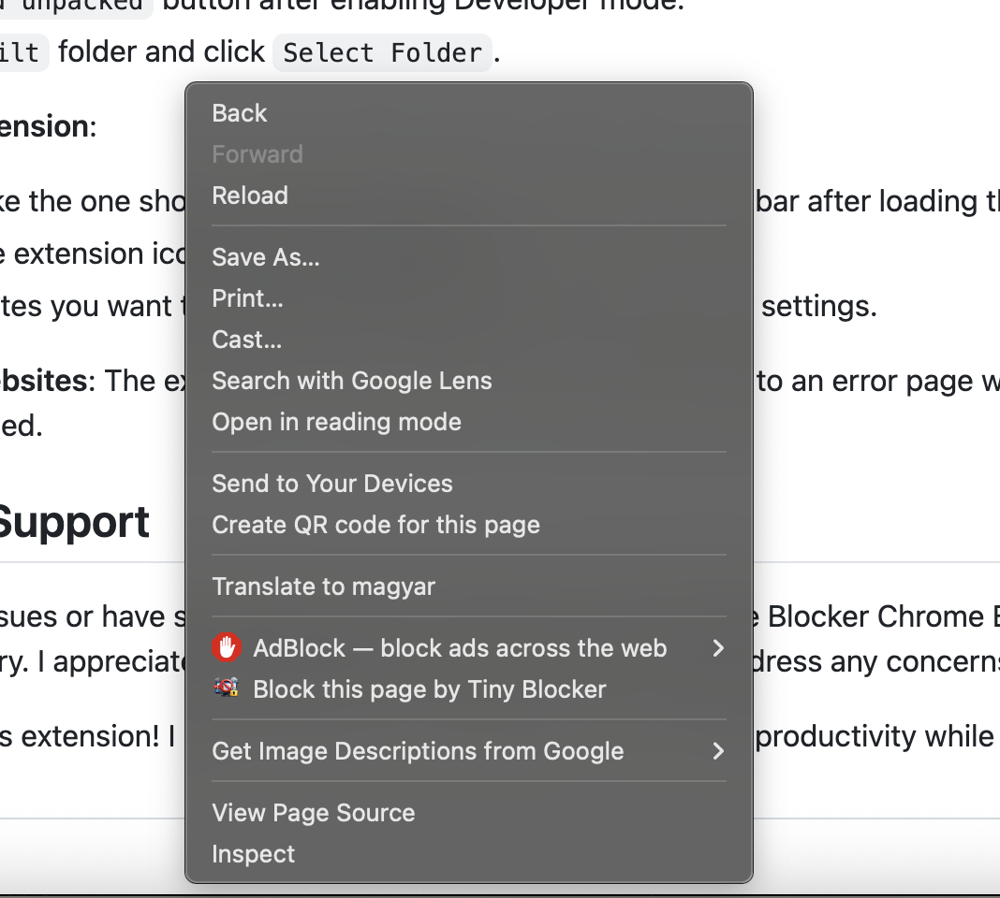

# Tiny Website Blocker Chrome Extension

Tiny Website Blocker is a lightweight, open-source Chrome extension that helps you reduce distractions by blocking websites you choose. It supports domain and exact-URL rules, per-site schedules, local statistics, and JSON backups while keeping all data in your browser with no tracking or external services.

**[Install Tiny Website Blocker from the Chrome Web Store](https://chromewebstore.google.com/detail/tiny-website-blocker/jggdghoiihbbflfhlaeaedbgemdcjpik)**

## Features

- **Domain and Exact-URL Blocking**: Block an entire website or one specific HTTP(S) page. Domain entries such as `example.com` and `https://example.com` are validated and normalized automatically.

- **Simple Rule Management**: Add, enable, disable, schedule, and delete rules from one clean, sorted, and paginated list.

- **Toolbar Controls**: Pause or resume all blocking, view the number of enabled rules and local statistics, and open the options page from the extension popup. **For quick access, open Chrome's puzzle-piece Extensions menu and pin Tiny Website Blocker.**

- **Per-site Schedules**: Optionally choose the active days and local start/end time for any rule, including overnight periods. Enabled rules without a schedule block at all times, while disabled rules never block.

- **Local Blocking Statistics**: View how many blocking attempts were stopped today and across all time. These aggregate counts remain in local browser storage and are never sent anywhere. Tiny Website Blocker does not use external APIs, make external network requests, or transmit locally stored data.

- **JSON Backup and Restore**: Export and import rules, per-site schedules, and the global blocking setting. **Export a backup before reinstalling Chrome, removing the extension, resetting your browser profile, or moving to another device. Without a backup, your locally stored configuration may be permanently lost.** Statistics remain private and are never included in backups.

- **Context Menu Quick Block**: On supported HTTP(S) pages, right-click and choose **Block this page by Tiny Blocker**, then select whether to block the domain or exact URL.

  

- **Friendly Blocking Page**: When a rule matches, the original tab is closed and a local page explains what was blocked. It may also show a joke or scientific quote.

- **Local and Private by Design**: Rules, schedules, settings, and statistics stay in Chrome's local extension storage. Tiny Website Blocker makes no external network requests or API calls and requires no account.

## Feedback and Support

If you encounter an issue or have a suggestion for Tiny Website Blocker, please [open an issue](https://github.com/janosvajda/chrome-extension-website-blocker/issues) in this GitHub repository. I appreciate your feedback and will do my best to address it.

Thank you for using this extension! I hope it helps you maintain your focus and productivity while browsing the web.

## Privacy, Licence, and Security

- **Privacy Policy**: See [PRIVACY.md](PRIVACY.md) for details about local data handling, retention, and Chrome permissions.

- **Free and Open Source**: Tiny Website Blocker is licensed under the [GNU General Public License v3.0](LICENSE). You may use, study, modify, and distribute it; distributed modified versions must remain under the GPL and provide their corresponding source code. There are no hidden fees or premium versions.

- **Local Data Only**: Blocking rules, schedules, settings, and aggregate statistics are stored only in your browser's local extension storage. Tiny Website Blocker does not use external APIs, make external network requests, or send this data anywhere. Removing the extension deletes its locally stored data.

## About

I created Tiny Website Blocker for myself after finding that other website blockers were paid or more complicated than I needed. I made it freely available for anyone looking for a simple, private way to reduce online distractions.

## Development and Maintenance

The following information is intended for maintainers, contributors, and developers.

### Project principles and contribution policy

Tiny Website Blocker has no runtime library dependencies. The only package listed under `dependencies` is `@types/chrome`, which provides compile-time TypeScript definitions for Chrome's extension APIs and is not included or executed in the published extension. Build tools, test frameworks, and other tooling are development-only dependencies.

I intend to keep this project simple, clean, private, and easy to audit. I will not accept pull requests that introduce external services, external APIs, network communication, or additional runtime dependencies. Contributions should preserve the extension's local-only architecture and use browser-native capabilities wherever possible.

### Local development setup

This project is developed and tested with Node.js 24, npm, and Google Chrome.

1. Clone the [GitHub repository](https://github.com/janosvajda/chrome-extension-website-blocker.git).
2. Run `npm ci` in the project root.
3. Run `npx playwright install chromium` to install the browser used by end-to-end tests. On Linux CI systems, use `npx playwright install --with-deps chromium`.
4. Run `npm run build` to generate the `built` directory.
5. Open `chrome://extensions` in Chrome and enable **Developer mode**.
6. Select **Load unpacked** and choose the generated `built` directory.

### Quality checks

```bash
npm run lint
npm run test:coverage
npm run test:e2e
```

These commands run static analysis, the Jest unit and integration suites with coverage thresholds, a production build, and the real Chromium extension tests.

### Release packaging

Create a fully verified, versioned Chrome Web Store ZIP with:

```bash
npm run publish
```

This runs the dependency audit, linting, Jest tests, real Chromium end-to-end tests, and production build before creating `release/tiny-website-blocker-<version>.zip`. The ZIP contains the contents of `built/` with `manifest.json` at its root. This command creates the upload artifact; it does not upload or publish it to the Chrome Web Store automatically.
